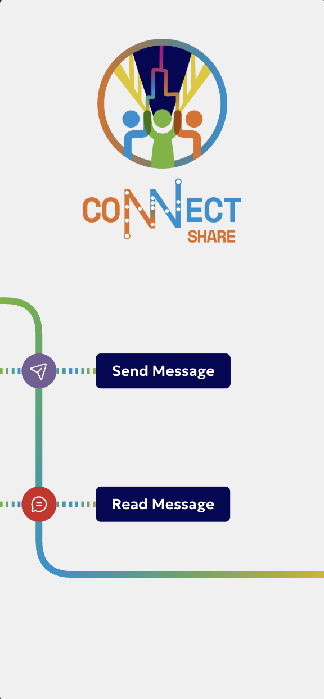

# Metro Voices

An anonymous message board where people share something they learned that positively changed their life — and read what others have shared.



## Features

- **Send** an anonymous message about something you learned
- **Read** a random message from someone else
- Metro-inspired visual design with animated line graphics

## Tech stack

- [Next.js 16](https://nextjs.org) (App Router)
- [React 19](https://react.dev)
- [Supabase](https://supabase.com) — message storage
- [Tailwind CSS 4](https://tailwindcss.com)
- TypeScript

## Getting started

Install dependencies:

```bash
npm install
```

Create a `.env.local` file with your Supabase credentials:

```env
NEXT_PUBLIC_SUPABASE_URL=your-supabase-url
NEXT_PUBLIC_SUPABASE_ANON_KEY=your-anon-key
```

Start the development server:

```bash
npm run dev
```

Open http://localhost:3000.

## Scripts

| Command         | Description              |
| --------------- | ------------------------ |
| `npm run dev`   | Start development server |
| `npm run build` | Build for production     |
| `npm run start` | Start production server  |
| `npm run test`  | Run tests                |
| `npm run lint`  | Run ESLint               |
